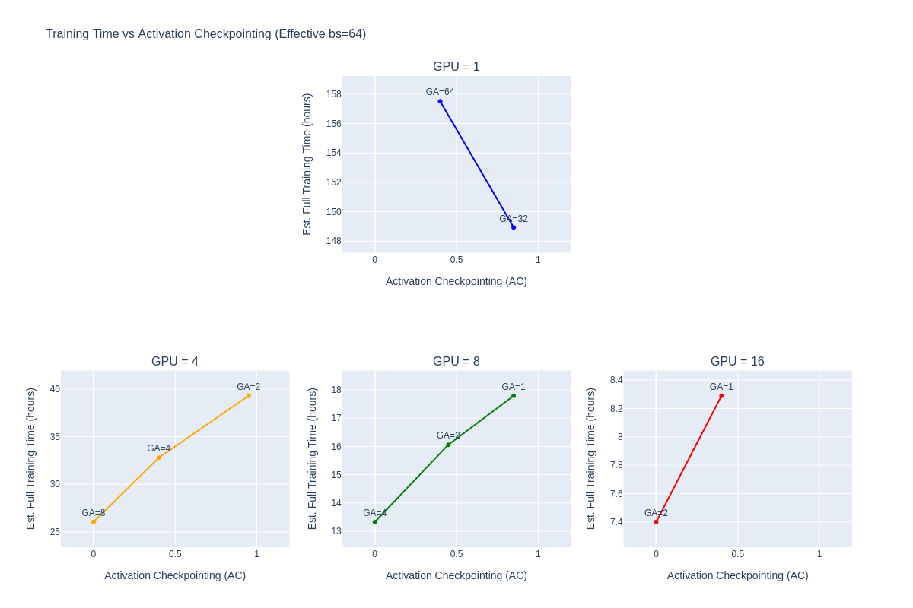

## Env installation

- From container: `singularity build nemo_2509.sif docker://nvcr.io/nvidia/nemo:25.09`

## Experience

### 1) FSDP2 + Selective Activation Checkpointing on H100 80 Go

#### Required AC and GA for multi-gpus training with fixed batch size per GPU (effective batch size = 64)

|         | bs=1          | bs=2           | bs=4          | bs=8          |
|---------|---------------|----------------|---------------|---------------|
| GPUs=1  | AC=0.4, GA=64 | AC=0.85, GA=32 | -             | -             |
| GPUs=4  | -             | AC=0.0, GA=8   | AC=0.4, GA=4  | AC=0.95, GA=2 |
| GPUs=8  | -             | AC=0.0, GA=4   | AC=0.45, GA=2 | AC=0.85, GA=1 |
| GPUs=16 | -             | AC=0.0, GA=2   | AC=0.4, GA=1  | -             |

- **AC** (Activation Checkpointing): ratio of activation layers that are not in memory (0.0 = all in memory, 1.0 = nothing in memory). Trades compute for memory.
- **GA** (Gradient Accumulation): number of forward/backward passes before optimizer step. Trades compute for memory.
- **Effective batch size** = GPUs × bs × GA = 64 for all configurations

#### Cost of Gradient Accumulation (bs=4, GA=2)

With GA=2, we perform 2 forward+backward on bs=4 passes before 1 optimizer step.

#### Cost of Activation Checkpointing (bs=8, GA=1)

With GA=1 and activation checkpointing, we perform 1 forward+backward on bs=8, plus a recompute cost of at most 1 additional forward on bs=8.

## Sources

- Original code: https://github.com/BertrandCabotPro/Democratizing-LLM-FT
- Source for FSDP + Selective activation checkpointing: https://pytorch.org/blog/maximizing-training/
- SLURM configuration for NeMo: https://docs.nvidia.com/nemo/automodel/latest/launcher/cluster.html
