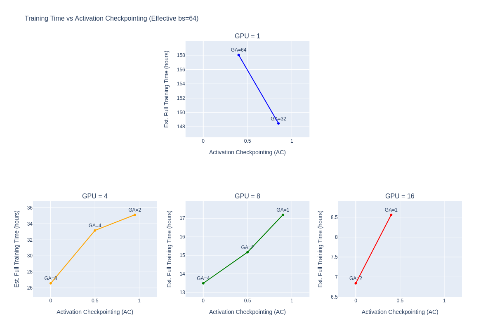
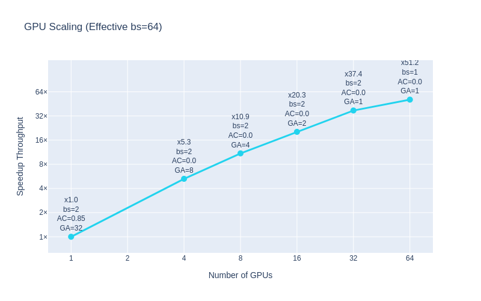
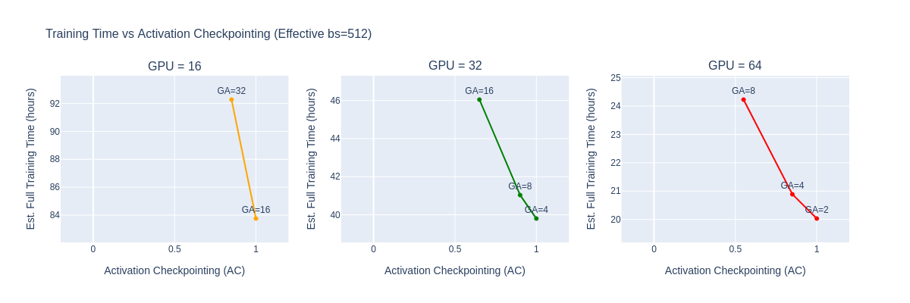
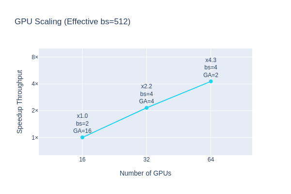
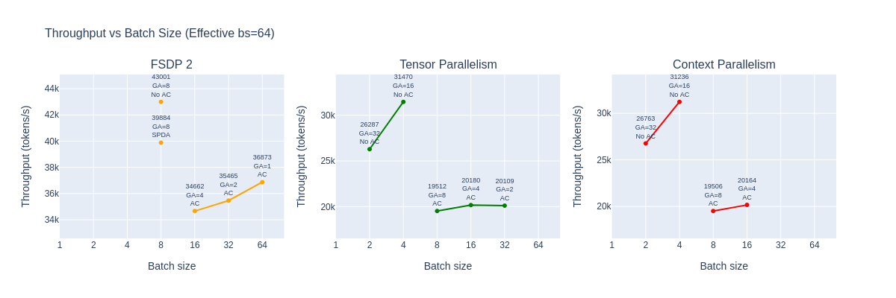

## Env installation

- From container: `singularity build nemo_2509.sif docker://nvcr.io/nvidia/nemo:25.09`

## Experience

- To balance variability in the results with computational cost, we report the median of three independent runs.

### 1) FSDP2 + Selective Activation Checkpointing (native PyTorch) on H100 80 Go (Qwen2.5-7B-Instruct)

#### Required AC and GA for multi-gpus training with fixed batch size per GPU (effective batch size = 64)

|         | bs=1          | bs=2           | bs=4         | bs=8          |
|---------|---------------|----------------|--------------|---------------|
| GPUs=1  | AC=0.4, GA=64 | AC=0.85, GA=32 | OOM          | OOM           |
| GPUs=4  | -             | AC=0.0, GA=8   | AC=0.5, GA=4 | AC=0.95, GA=2 |
| GPUs=8  | -             | AC=0.0, GA=4   | AC=0.5, GA=2 | AC=0.90, GA=1 |
| GPUs=16 | -             | AC=0.0, GA=2   | AC=0.4, GA=1 | -             |
| GPUs=32 | -             | AC=0.0, GA=1   | -            | -             |
| GPUs=64 | AC=0.0, GA=1  | -              | -            | -             |

- **AC** (Activation Checkpointing): ratio of activation layers that are not in memory (0.0 = all in memory, 1.0 = nothing in memory). Trades compute for memory.
- **GA** (Gradient Accumulation): number of forward/backward passes before optimizer step. Trades compute for memory.
- **Effective batch size** = GPUs × bs × GA = 64 for all configurations.
- **OOM** (Out of memory).
- **-**: configuration skipped because the effective batch size exceeds 64, or because of lower throughput than an equivalent setup with same GPUs and larger batch size.

#### Training time depending on the number of GPUs and on the effect of Selective Activation Checkpointing

- The 7B model cannot be trained on a single GPU with **BF16** alone, **AC** is required to fit it in memory. Additionally, the strong scaling across multiple GPUs yields near-linear speedup, which is a great way to maximize the throughput (for the same effective batch size).
- By increasing the bs thanks to the selective activation checkpointing, we expected to speed-up the training as we reduce the costly gradient accumulation. Furthermore, since we are doing less forwards/backwards in total, it should be further speed-up as we reduce the number of communication. However as soon as we use FSDP2 (multi-gpus training), AC starts actually increasing the training time. Why ?

#### Analysis on 4 GPUs with effective batch size = 4

- With GA=4, we perform 4 forward+backward on bs=1 passes before 1 optimizer step.
- With GA=2 and activation checkpointing, we perform 2 forward+backward on bs=2, plus a recompute cost of at most 2 additional forwards on bs=2.
- In theory, forward/backward on bs=2 should be more efficient than 2 forward/backward on bs=1 as we use more efficiently the GPU (parallelizing on the dimension of the batch) and reduce the overhead of launching multiple kernels.
- In practice, when looking at the forward, the time actually increased almost linearly on the bs ([trace for bs=1](asset/forward_bs1.png) / [trace for bs=2](asset/forward_bs2.png)), passing from **138 ms** to **258 ms**. If we zoom at the forward, it is made of the forward of **28 attention layers** with each attention layer forward scaling linearly. Inside of these attention layer forward, we have 4 big kernels that dominate and among them, the biggest kernel scales from **1,123 ms** to **2,224 ms** ([trace for bs=1](asset/forward_attention_layer_bs1.png) / [trace for bs=2](asset/forward_attention_layer_bs2.png)).
- In bs=1 and bs=2, the kernel configuration is identical: 132 blocks and 384 threads per block, which means that we are actually asking for each thread to work twice as much ( twice the data transfer and twice the computation).
- Since we have 1 block per SM (132 SM in H100) and 4 schedulers per SM, and each scheduler deals by group of 32 threads. Each scheduler has 3 groups.
- By using Nsight compute, we can see that the average scheduler executed 530 524 instructions for bs=1 and 1 060 689 instructions for bs=2. Thus we can infer that each group of threads is dealing with twice the work by doing it sequentially.
- In Nsight compute, with bs=1, the Tensor Core is only active 31% of cycles and memory throughput reaches 60%. This suggests spare capacity exists. In theory, bs=2 instructions could fill the idle cycles by interleaving sample 0 and sample 1 operations within each warp. However, this interleaving would require storing two independent working contexts simultaneously in registers, which is limited. The bottleneck here may be due to the on-chip memory (we could try to verify by looking at the warp lifecycle and monitor the pipe usage and register usage).

#### Max Throughput (number of input tokens/s) with fixed effective batch size = 64

|                           | GPUs=1        | GPUs=4         | bs=8           | bs=16           | bs=32           | bs=64           |
|---------------------------|---------------|----------------|----------------|-----------------|-----------------|-----------------|
| Throughput                | 7113 tokens/s | 37470 tokens/s | 77815 tokens/s | 144622 tokens/s | 266123 tokens/s | 364308 tokens/s |
| bs/GPU                    | 2             | 2              | 2              | 2               | 2               | 1               |
| Median Est. Step Duration | 1.138 s       | 0.816 s        | 0.827 s        | 0.837 s         | 0.851 s         | 0.558 s         |

- Est. Step Duration: CUDA Event was used to measure the time taken for a single step (=1 Host-to-Device transfer + 1 forward + 1 backward + optional Optimizer update)
- Median Est. Step Duration: The median of all the `Est. Step Duration`in a single run.
- `Median Est. Step Duration` increases for `GPUs=1` because of the additional overhead from activation checkpointing.
- `Median Est. Step Duration` decreases for `GPUs=64` due to `bs/GPU=1`.

### 2) FSDP2 + Selective Activation Checkpointing (native PyTorch) on H100 80 Go (Qwen2.5-72B-Instruct)

#### Required AC and GA for multi-gpus training with fixed batch size per GPU (effective batch size = 512)

|         | bs=1          | bs=2           | bs=4         | bs=8 |
|---------|---------------|----------------|--------------|------|
| GPUs=8  | OOM           | OOM            | OOM          | OOM  |
| GPUs=16 | AC=0.85 GA=32 | AC=1.0, GA=16  | OOM          | OOM  |
| GPUs=32 | AC=0.65 GA=16 | AC=0.9, GA=8   | AC=1.0, GA=4 | OOM  |
| GPUs=64 | AC=0.55 GA=8  | AC=0.85, GA=4  | AC=1.0, GA=2 | OOM  |

- **AC** (Activation Checkpointing): ratio of activation layers that are not in memory (0.0 = all in memory, 1.0 = nothing in memory). Trades compute for memory.
- **GA** (Gradient Accumulation): number of forward/backward passes before optimizer step. Trades compute for memory.
- **Effective batch size** = GPUs × bs × GA = 512 for all configurations.
- **OOM** (Out of memory).

#### Training time depending on the number of GPUs and on the effect of Selective Activation Checkpointing

- The 72B model cannot be trained on 64 GPUs with **BF16** alone,  **AC** is required to fit it in memory.
- Trading GA for AC speedups our training.

#### Max Throughput (number of input tokens/s) with fixed effective batch size = 512

|                           | bs=16          | bs=32          | bs=64          |
|---------------------------|----------------|----------------|----------------|
| Throughput                | 12067 tokens/s | 25997 tokens/s | 51459 tokens/s |
| bs/GPU                    | 2              | 4              | 4              |
| Median Est. Step Duration | 10.271 s       | 19.522 s       | 19.612 s       |

- Est. Step Duration: CUDA Event was used to measure the time taken for a single step (=1 Host-to-Device transfer + 1 forward + 1 backward + optional Optimizer update)
- Median Est. Step Duration: The median of all the `Est. Step Duration`in a single run.

### 3) Intra-Node Parallelism comparison (NeMo) on H100 80 Go (Qwen2.5-7B-Instruct)

- The sharding in FSDP2 on NeMo is done automatically (and may have an optimized sharding) unlike in previous experiences.

#### 1D efficiency depending on bs

- Intra-Node H100: **4 GPUs**
- Attention Implementation: **FlashAttention 2**
- Bigger bs improves compute performance in 1D parallelism on this model.
- Using AC to increase bs degrades compute performance in 1D parallelism on this model.
- FlashAttention 2 is faster than SPDA.

#### Max Throughput (number of input tokens/s) with fixed effective batch size = 64 (GPUs=4)

|                           | 4 fsdp         | 4 tp           | 4 cp           | 2 fsdp 2 tp    | 2 fsdp 2 cp    | 2 tp 2 cp      |
|---------------------------|----------------|----------------|----------------|----------------|----------------|----------------|
| Throughput                | 43001 tokens/s | 31470 tokens/s | 31236 tokens/s | 35326 tokens/s | 48184 tokens/s | 30754 tokens/s |
| bs/GPU                    | 2              | 4              | 4              | 4              | 4              | 4              |
| Median Est. Step Duration | 0.644 s        | 0.496 s        | 0.498 s        | 0.872 s        | 0.669 s        | 0.523 s        |
| GA                        | 8              | 16             | 16             | 8              | 8              | 16             |

- We avoid using AC.
- In 1D setting, FSDP2 is more efficient than TP or CP, however it is limited by bs/GPU=2.
- In 2D setting, with a combination of FSDP2 and CP, we benefit both from FSDP's communication efficiency and CP's ability to double the effective batch size per GPU (from 2 to 4), resulting in the highest throughput at 48184 tokens/s, a 12% improvement over the best 1D configuration.

### 4) FSDP2+TP+CP (NeMo) on H100 80 Go (Qwen2.5-72B-Instruct)

### Issues

- I tried to monitor the GPU by capturing the trace via Nsight system (`nsys profile --trace osrt,cuda,cublas,cudnn,nvtx`), but I couldn't get the detailed GPU view, instead I've got only the CPU view and the Process view (which has some GPU metrics).
- Conflict with gradient clipping and Tensor parallelism inside NeMo due to some layers not being in the same device mesh as the Multi-Head Attention layers.
- Conflict with the dataset and Context parallelism inside NeMo due to missing `loss_mask` in dataset.

## Sources

- Original code: https://github.com/BertrandCabotPro/Democratizing-LLM-FT
- Source for FSDP + Selective activation checkpointing: https://pytorch.org/blog/maximizing-training/
- SLURM configuration for NeMo: https://docs.nvidia.com/nemo/automodel/latest/launcher/cluster.html
- Nvidia GPU guide: https://modal.com/gpu-glossary
