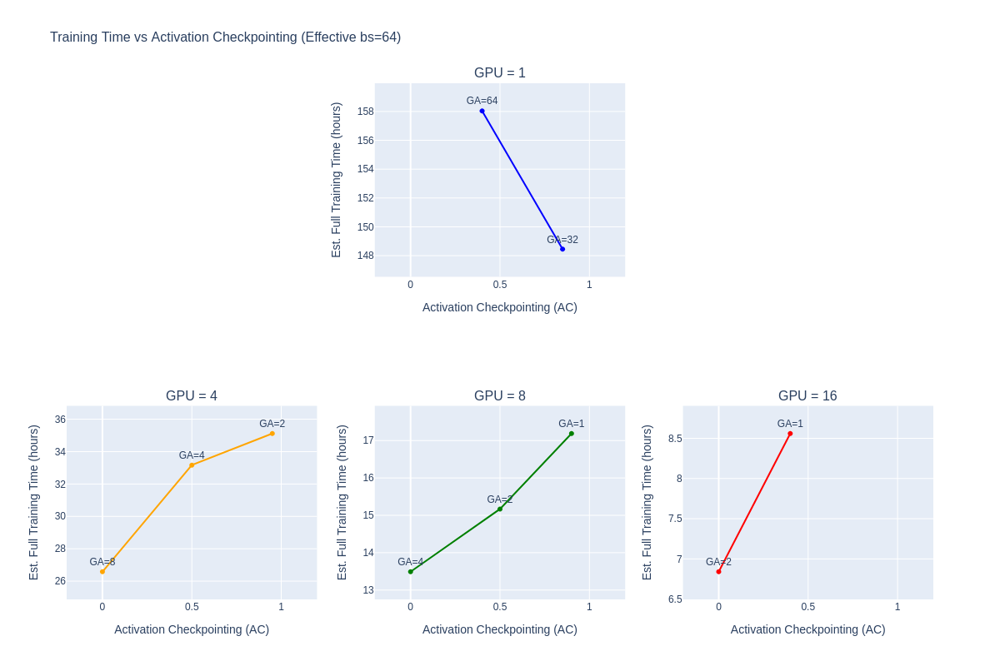
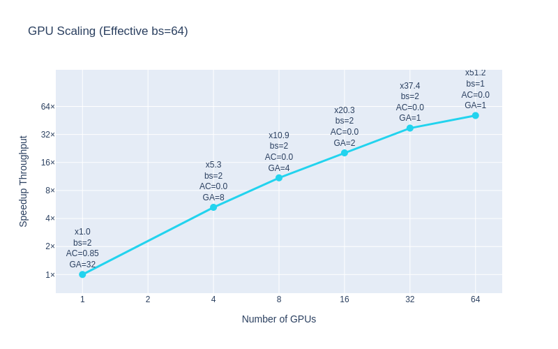
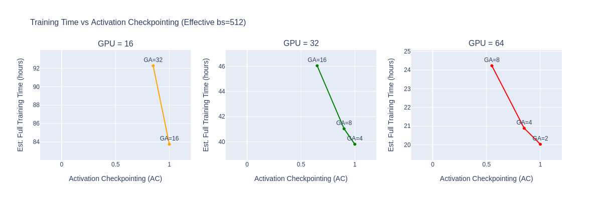
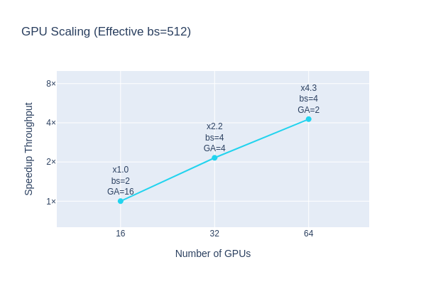
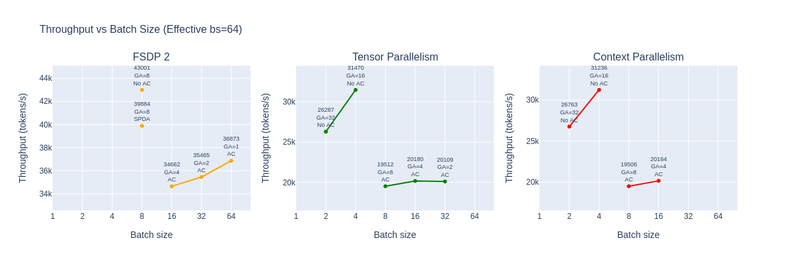
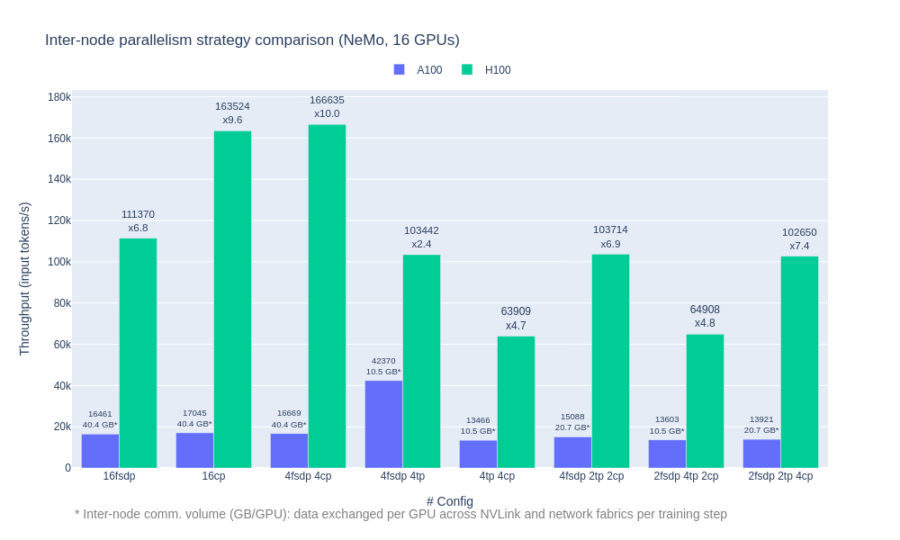

## Env installation

- From container: `singularity build nemo_2509.sif docker://nvcr.io/nvidia/nemo:25.09`

## Experience

- To balance variability in the results with computational cost, we report the median of three independent runs.

### 1) FSDP2 + Selective Activation Checkpointing (native PyTorch) on H100 80 Go (Qwen2.5-7B-Instruct)

#### Required AC and GA for multi-gpus training with fixed batch size per GPU (effective batch size = 64)

|         | bs=1          | bs=2           | bs=4         | bs=8          |
|---------|---------------|----------------|--------------|---------------|
| GPUs=1  | AC=0.4, GA=64 | AC=0.85, GA=32 | OOM          | OOM           |
| GPUs=4  | -             | AC=0.0, GA=8   | AC=0.5, GA=4 | AC=0.95, GA=2 |
| GPUs=8  | -             | AC=0.0, GA=4   | AC=0.5, GA=2 | AC=0.90, GA=1 |
| GPUs=16 | -             | AC=0.0, GA=2   | AC=0.4, GA=1 | -             |
| GPUs=32 | -             | AC=0.0, GA=1   | -            | -             |
| GPUs=64 | AC=0.0, GA=1  | -              | -            | -             |

- **AC** (Activation Checkpointing): ratio of activation layers that are not in memory (0.0 = all in memory, 1.0 = nothing in memory). Trades compute for memory.
- **GA** (Gradient Accumulation): number of forward/backward passes before optimizer step. Trades compute for memory.
- **Effective batch size** = GPUs × bs × GA = 64 for all configurations.
- **OOM** (Out of memory).
- **-**: configuration skipped because the effective batch size exceeds 64, or because of lower throughput than an equivalent setup with same GPUs and larger batch size.

#### Training time depending on the number of GPUs and on the effect of Selective Activation Checkpointing

- The 7B model cannot be trained on a single GPU with **BF16** alone, **AC** is required to fit it in memory. Additionally, the strong scaling across multiple GPUs yields near-linear speedup, which is a great way to maximize the throughput (for the same effective batch size).
- By increasing the bs thanks to the selective activation checkpointing, we expected to speed-up the training as we reduce the costly gradient accumulation. Furthermore, since we are doing less forwards/backwards in total, it should be further speed-up as we reduce the number of communication. However as soon as we use FSDP2 (multi-gpus training), AC starts actually increasing the training time. Why ?

#### Analysis on 4 GPUs with effective batch size = 4

- With GA=4, we perform 4 forward+backward on bs=1 passes before 1 optimizer step.
- With GA=2 and activation checkpointing, we perform 2 forward+backward on bs=2, plus a recompute cost of at most 2 additional forwards on bs=2.
- In theory, forward/backward on bs=2 should be more efficient than 2 forward/backward on bs=1 as we use more efficiently the GPU (parallelizing on the dimension of the batch) and reduce the overhead of launching multiple kernels.
- In practice, when looking at the forward, the time actually increased almost linearly on the bs ([trace for bs=1](asset/forward_bs1.png) / [trace for bs=2](asset/forward_bs2.png)), passing from **138 ms** to **258 ms**. If we zoom at the forward, it is made of the forward of **28 attention layers** with each attention layer forward scaling linearly. Inside of these attention layer forward, we have 4 big kernels that dominate and among them, the biggest kernel scales from **1,123 ms** to **2,224 ms** ([trace for bs=1](asset/forward_attention_layer_bs1.png) / [trace for bs=2](asset/forward_attention_layer_bs2.png)).
- In bs=1 and bs=2, the kernel configuration is identical: 132 blocks and 384 threads per block, which means that we are actually asking for each thread to work twice as much ( twice the data transfer and twice the computation).
- Since we have 1 block per SM (132 SM in H100) and 4 schedulers per SM, and each scheduler deals by group of 32 threads. Each scheduler has 3 groups.
- By using Nsight compute, we can see that the average scheduler executed 530 524 instructions for bs=1 and 1 060 689 instructions for bs=2. Thus we can infer that each group of threads is dealing with twice the work by doing it sequentially.
- In Nsight compute, with bs=1, the Tensor Core is only active 31% of cycles and memory throughput reaches 60%. This suggests spare capacity exists. In theory, bs=2 instructions could fill the idle cycles by interleaving sample 0 and sample 1 operations within each warp. However, this interleaving would require storing two independent working contexts simultaneously in registers, which is limited. The bottleneck here may be due to the on-chip memory (we could try to verify by looking at the warp lifecycle and monitor the pipe usage and register usage).

#### Max Throughput (number of input tokens/s) with fixed effective batch size = 64

|                           | GPUs=1        | GPUs=4         | GPUs=8         | GPUs=16         | GPUs=32         | GPUs=64           |
|---------------------------|---------------|----------------|----------------|-----------------|-----------------|-----------------|
| Throughput                | 7113 tokens/s | 37470 tokens/s | 77815 tokens/s | 144622 tokens/s | 266123 tokens/s | 364308 tokens/s |
| bs/GPU                    | 2             | 2              | 2              | 2               | 2               | 1               |
| Median Est. Step Duration | 1.138 s       | 0.816 s        | 0.827 s        | 0.837 s         | 0.851 s         | 0.558 s         |

- Est. Step Duration: CUDA Event was used to measure the time taken for a single step (=1 Host-to-Device transfer + 1 forward + 1 backward + optional Optimizer update)
- Median Est. Step Duration: The median of all the `Est. Step Duration`in a single run.
- `Median Est. Step Duration` increases for `GPUs=1` because of the additional overhead from activation checkpointing.
- `Median Est. Step Duration` decreases for `GPUs=64` due to `bs/GPU=1`.

### 2) FSDP2 + Selective Activation Checkpointing (native PyTorch) on H100 80 Go (Qwen2.5-72B-Instruct)

#### Required AC and GA for multi-gpus training with fixed batch size per GPU (effective batch size = 512)

|         | bs=1          | bs=2           | bs=4         | bs=8 |
|---------|---------------|----------------|--------------|------|
| GPUs=8  | OOM           | OOM            | OOM          | OOM  |
| GPUs=16 | AC=0.85 GA=32 | AC=1.0, GA=16  | OOM          | OOM  |
| GPUs=32 | AC=0.65 GA=16 | AC=0.9, GA=8   | AC=1.0, GA=4 | OOM  |
| GPUs=64 | AC=0.55 GA=8  | AC=0.85, GA=4  | AC=1.0, GA=2 | OOM  |

- **AC** (Activation Checkpointing): ratio of activation layers that are not in memory (0.0 = all in memory, 1.0 = nothing in memory). Trades compute for memory.
- **GA** (Gradient Accumulation): number of forward/backward passes before optimizer step. Trades compute for memory.
- **Effective batch size** = GPUs × bs × GA = 512 for all configurations.
- **OOM** (Out of memory).

#### Training time depending on the number of GPUs and on the effect of Selective Activation Checkpointing

- The 72B model cannot be trained on 64 GPUs with **BF16** alone,  **AC** is required to fit it in memory.
- Trading GA for AC speedups our training.

#### Max Throughput (number of input tokens/s) with fixed effective batch size = 512

|                           | GPUs=16        | GPUs=32        | GPU=64         |
|---------------------------|----------------|----------------|----------------|
| Throughput                | 12067 tokens/s | 25997 tokens/s | 51459 tokens/s |
| bs/GPU                    | 2              | 4              | 4              |
| Median Est. Step Duration | 10.271 s       | 19.522 s       | 19.612 s       |

- Est. Step Duration: CUDA Event was used to measure the time taken for a single step (=1 Host-to-Device transfer + 1 forward + 1 backward + optional Optimizer update)
- Median Est. Step Duration: The median of all the `Est. Step Duration`in a single run.

### 3) Intra-Node Parallelism comparison (NeMo) on H100 80 Go (Qwen2.5-7B-Instruct)

- The sharding in FSDP2 on NeMo is done automatically (and may have an optimized sharding) unlike in previous experiences.
- Parameter sharding is done in the dimension of DP+CP, so even with DP=1, the model is still sharded and requires AllGather operations during forward and backward.

#### 1D efficiency depending on bs

- Intra-Node H100: **4 GPUs**
- Attention Implementation: **FlashAttention 2**
- Bigger bs improves compute performance in 1D parallelism on this model.
- Using AC to increase bs degrades compute performance in 1D parallelism on this model.
- FlashAttention 2 is faster than SPDA.

#### Max Throughput (number of input tokens/s) with fixed effective batch size = 64 (GPUs=4)

|                           | 4fsdp Pytorch  | 4fsdp          | 4tp            | 4cp            | 2fsdp 2tp      | 2fsdp 2cp      | 2tp 2cp        |
|---------------------------|----------------|----------------|----------------|----------------|----------------|----------------|----------------|
| Throughput                | 35021 tokens/s | 42951 tokens/s | 31168 tokens/s | 40275 tokens/s | 35139 tokens/s | 48044 tokens/s | 30587 tokens/s |
| bs/GPU                    | 2              | 2              | 4              | 4              | 4              | 4              | 4              |
| GA                        | 8              | 8              | 16             | 16             | 8              | 8              | 16             |
| Median Est. Step Duration | 0.812 s        | 0.644 s        | 0.500 s        | 0.401 s        | 0.879 s        | 0.671 s        | 0.528 s        |

- We are using `FSDP2Strategy` which has options for Context Paralellism (CP) and Tensor Parallelism (TP).
- The best results are given by maximizing the bs/GPU without using AC.
- In 1D setting, FSDP2 in NeMo is more efficient than the native PyTorch implementation because it performs the gradient ReduceScatter in half precision rather than full precision, halving the communication volume.
- In 1D setting, FSDP2 is more efficient than TP or CP, however it is limited by bs/GPU=2.
- In 2D setting, FSDP2+CP shows higher throughput (48044 tokens/s) than pure FSDP2 (42951 tokens/s), despite the median step duration being longer for FSDP2+CP (0.671 s vs 0.644 s). This discrepancy is due to occasional NCCL kernel stalls in the FSDP2 configuration that are not captured by the median but inflate the overall training time.

| Métrique/STEP              | Sous-Métrique/STEP        | 4fsdp Pytorch   | 4fsdp           | 4tp             | 4cp             | 2fsdp 2tp       | 2fsdp 2cp       | 2tp 2cp         |
|----------------------------|---------------------------|-----------------|-----------------|-----------------|-----------------|-----------------|-----------------|-----------------|
| Median Duration            |                           |                 | **656.0 ms**    | **495.7 ms**    | **424.2 ms**    | **884.0 ms**    | **675.6 ms**    | **535.3 ms**    |
| Est. Communication Volume  |                           | **44.1 GB/GPU** | **32.3 GB/GPU** | **34.5 GB/GPU** | **32.3 GB/GPU** | **34.9 GB/GPU** | **32.3 GB/GPU** | **23.4 GB/GPU** |
| Sum of NCCL Kernels (Ovl)  |                           |                 | **138.8 ms**    | **111.8 ms**    | **143.7 ms**    | **551.4 ms**    | **185.5 ms**    | **265.5 ms**    |
| Comm Elapsed Time          |                           |                 | **138.8 ms**    | **111.8 ms**    | **143.7 ms**    | **509.5 ms**    | **185.5 ms**    | **247.7 ms**    |
|                            | Comm-Compute Elapsed Time |                 | 124.6 ms        | 0.0 ms          | 102.7 ms        | 260.1 ms        | 169.8 ms        | 99.0 ms         |
|                            | Comm only Elapsed Time    |                 | 14.2 ms         | 111.8 ms        | 41.0 ms         | 249.4 ms        | 15.7 ms         | 148.7 ms        |
|                            | Overlap Efficiency        |                 | 89.8%           | 0.0%            | 71.5%           | 51.1%           | 91.5%           | 40.0%           |
| Effective NVLink Bandwidth |                           |                 | **233 GB/s**    | **309 GB/s**    | **225 GB/s**    | **63.2 GB/s**   | **174 GB/s**    | **88.0 GB/s**   |
| Sum of NCCL Kernels (Seq)  |                           |                 | **108.0 ms**    | **109.4 ms**    | **109.4 ms**    | **359.3 ms**    | **110.1 ms**    | **234.7 ms**    |
|                            | Gain From Seq to Ovl      |                 | **61.1 ms**     | **X**           | **42.4 ms**     | **57.2 ms**     | **57.2 ms**     | **82.1 ms**     |
| Est. FLOPs                 |                           |                 | **321 TFLOPs**  | **642 TFLOPs**  | **174 TFLOPs**  | **OOM**         | **348 TFLOPs**  | **348 TFLOPs**  |
| Sum of Compute Kernels     |                           |                 | **577.3 ms**    | **320.7 ms**    | **318.6 ms**    | **570.6 ms**    | **595.4 ms**    | **322.8 ms**    |
| Est. FLOP/s                |                           | -               | **556 TFLOP/s** | **2002 TFLOP/s**| **546 TFLOP/s** | -               | **584 TFLOP/s** | **1078 TFLOP/S**|

- `Median Duration` is given by looking at the pytorch profiler, unlike `Median Est. Step Duration` which is estimated with `torch.cuda.Event`.
- `Est. Communication Volume` is estimated by parsing NCCL log.
- `Sum of NCCL Kernels (Ovl)` is given by looking at the total duration of all NCCL kernels when compute overlapping is enable.
- `Comm-Compute Elapsed Time` is the elapsed time during which a compute kernel and at least 1 nccl kernel exist.
- `Comm only Elapsed Time` is the elapsed time during which at least 1 nccl kernel exists while no compute kernel is running.
- `Comm-Compute Elapsed Time + Comm only Elapsed Time` represents the total wall-clock time where at least one NCCL kernel is running. This differs from `Sum of NCCL Kernels` which counts overlapping NCCL kernels multiple times.
- `Effective NVLink Bandwidth` = `Est. Communication Volume` / `Sum of NCCL Kernels (Ovl)`
- `Sum of NCCL Kernels (Seq)` is given by looking at the total duration of all NCCL kernels when compute overlapping is disable.
- `Sum of NCCL Kernels (Ovl) > Sum of NCCL Kernels (Seq)` because NCCL kernels run slower when competing with compute kernels for GPU resources (SM contention, memory bandwidth).
- `Gain From Seq to Ovl` is the gain from using a fully sequential cuda execution to a parallel compute-comm cuda execution.
- `Est. FLOPs` uses [`FlopCounterMode`](https://github.com/pytorch/pytorch/blob/main/torch/utils/flop_counter.py) in PyTorch.
  - **Limitations** (see [pytorch/pytorch#123800](https://github.com/pytorch/pytorch/issues/123800)):
    - Only counts matmul, conv, and attention ops; elementwise ops are not counted.
    - Intended usage with `torch.compile` is to run it on an **uncompiled** model first.
    - Incurs significant memory overhead, which can cause CUDA OOM when GPU memory is tight.
- `4tp` shows 0.0 ms for `Comm-Compute Elapsed Time`, meaning TP has no compute-comm overlap (all NCCL happens during idle time). This explains why `Gain From Seq to Ovl = X` (no gain).
- `4tp` maximizes the Tensor Core utilization during compute kernel by using the biggest bs/GPU available, but lost a lot of time in comm. since it is unable to overlap compute and communication.
- Ranking strategies by overlap efficiency tracks the throughput ranking almost perfectly, confirming that on intra-node with only NVLink as fabric, the ability to hide communication behind compute is the dominant factor determining training speed.
- CP uses as much communication volume as FSDP2, AllGather on model shards and ReduceScatter on gradients, yet we can't see the communication of K/V for the ring attention, since it is [hidden inside the self-attention kernel](https://docs.nvidia.com/nemo-framework/user-guide/26.02/nemotoolkit/features/optimizations/communication_overlap.html#context-parallel-communication-overlap). `FSDP2Strategy` shards effectively the model along the dimension of DP and CP, which explains the AllGather on model shards and the ReduceScatter on gradients.

### 4) Inter-Node Parallelism comparison (NeMo) on A100 / H100 80 Go (Qwen2.5-7B-Instruct)

#### 4 nodes baseline H100

|                           | 16fsdp          | 16cp            | 4fsdp 4cp       | 4fsdp 4tp       | 4tp 4cp         | 4fsdp 2tp 2cp   | 2fsdp 4tp 2cp   | 2fsdp 2tp 4cp   |
|---------------------------|-----------------|-----------------|-----------------|-----------------|-----------------|-----------------|-----------------|-----------------|
| Throughput                | 111370 tokens/s | 163524 tokens/s | 166635 tokens/s | 103442 tokens/s | 63909 tokens/s  | 103714 tokens/s | 64908 tokens/s  | 102650 tokens/s |
| bs/GPU                    | 2               | 32              | 8               | 8               | 8               | 4               | 4               | 8               |
| GA                        | 2               | 2               | 2               | 2               | 8               | 4               | 8               | 4               |
| Median Est. Step Duration | 0.786 s         | 0.809 s         | 0.786 s         | 1.143 s         | 0.471 s         | 0.595 s         | 0.468 s         | 0.599 s         |

- Due to occasional NCCL kernel stalls in the FSDP2 configuration, some steps can be up to 3× longer than the median step duration.
- `16fsdp` (NeMo) is slower than `16fsdp PyTorch` (c.f. above), even though theoretically it should be quicker due to the decrease in comm. traffic).

| Métrique/STEP              | Sous-Métrique/STEP        | 16fsdp          | 16cp            | 4fsdp 4cp       | 4fsdp 4tp       | 4tp 4cp         | 4fsdp 2tp 2cp   | 2fsdp 4tp 2cp   | 2fsdp 2tp 4cp   |
|----------------------------|---------------------------|-----------------|-----------------|-----------------|-----------------|-----------------|-----------------|-----------------|-----------------|
| Median Duration            |                           | **2436 ms**     | **837.6 ms**    | **817.2 ms**    | **1152 ms**     | **476.1 ms**    | **589.4 ms**    | **474.9 ms**    | **592.9 ms**    |
| Est. Communication Volume  |                           | **40.4 GB/GPU** | **40.4 GB/GPU** | **40.4 GB/GPU** | **79.6 GB/GPU** | **27.8 GB/GPU** | **32.3 GB/GPU** | **27.8 GB/GPU** | **32.3 GB/GPU** |
|                            | NVLink                    |                 |                 |                 | 69.1 GB/GPU     | 17.3 GB/GPU     | 11.5 GB/GPU     | 17.3 GB/GPU     | 11.5 GB/GPU     |
|                            | Network                   |                 |                 |                 | 10.5 GB/GPU     | 10.5 GB/GPU     |                 | 10.5 GB/GPU     |                 |
|                            | NVLink + Network          | 40.4 GB/GPU     | 40.4 GB/GPU     | 40.4 GB/GPU     |                 |                 | 20.7 GB/GPU     |                 | 20.7 GB/GPU     |
| Sum of NCCL Kernels (Ovl)  |                           | **2189 ms**     | **234.0 ms**    | **355.7 ms**    | **736.1 ms**    | **306.5 ms**    | **409.9 ms**    | **374.8 ms**    | **346.3 ms**    |
| Comm Elapsed Time          |                           | **2189 ms**     | **234.0 ms**    | **355.6 ms**    | **674,2 ms**    | **280.7 ms**    | **362.5 ms**    | **330.8 ms**    | **314.7 ms**    |
|                            | Comm-Compute Elapsed Time | 373.9 ms        | 207.3 ms        | 323.8 ms        | 363.0 ms        | 100.7 ms        | 179.6 ms        | 142.2 ms        | 140.5 ms        |
|                            | Comm only Elapsed Time    | 1815 ms         | 26.7 ms         | 31.8 ms         | 311.2 ms        | 180.0 ms        | 182.9 ms        | 188.6 ms        | 174.2 ms        |
|                            | Overlap Efficiency        | 17.1%           | 88.8%           | 91.1%           | 53.8%           | 35.9%           | 49.5%           | 43.0%           | 44.6%           |
| Effective Comm Bandwidth   |                           |                 |                 |                 |                 |                 |                 |                 |                 |
|                            | NVLink                    |                 |                 |                 | 319.7 GB/s      | 282.3 GB/s      | 96.3 GB/s       | 195.1 GB/s      | 99.0 GB/s       |
|                            | Network                   |                 |                 |                 | 20.2 GB/s       | 42.9 GB/s       |                 | 36.8 GB/s       |                 |
|                            | NVLink + Network          | 18.4 GB/s       | 172.5 GB/s      | 113.5 GB/s      |                 |                 | 71.4  GB/s      |                 | 90.2 GB/s       |
| Sum of NCCL Kernels (Seq)  |                           | **2033 ms**     | **209.8 ms**    | **214.4 ms**    | **520.4 ms**    | **292.6 ms**    | **355.7 ms**    | **335.5 ms**    | **345.2 ms**    |
|                            | Gain From Seq to Ovl      | **162 ms**      | **149 ms**      | **134 ms**      | **161 ms**      | **94.8 ms**     | **143.1 ms**    | **123.7 ms**    | **133.7 ms**    |
| Est. FLOPs                 |                           | **X TFLOPs**    | **X TFLOPs**    | **X TFLOPs**    | **X TFLOPs**    | **X TFLOPs**    | **X TFLOPs**    | **X TFLOPs**    | **X TFLOPs**    |
| Sum of Compute Kernels     |                           | **555.6 ms**    | **643.3 ms**    | **611.1 ms**    | **681.5 ms**    | **234.5 ms**    | **343.3 ms**    | **230.6 ms**    | **359.2 ms**    |
| Est. FLOP/s                |                           | **X TFLOP/s**   | **X TFLOP/s**   | **X TFLOP/s**   | **X TFLOPs**    | **X TFLOP/s**   | **X TFLOP/S**   | **X TFLOPs**    | **X TFLOPs**    |

- Compared to `4cp`, `16cp` has a significant increase in `Sum of Compute Kernels`, mainly due to communication over the network inside of compute kernels.

#### 4 nodes baseline A100

|                           | 16fsdp          | 16cp            | 4fsdp 4cp       | 4fsdp 4tp       | 4tp 4cp         | 4fsdp 2tp 2cp   | 2fsdp 4tp 2cp   | 2fsdp 2tp 4cp   |
|---------------------------|-----------------|-----------------|-----------------|-----------------|-----------------|-----------------|-----------------|-----------------|
| Throughput                | 16461 tokens/s  | 17045 tokens/s  | 16669 tokens/s  | 42370 tokens/s  | 13466 tokens/s  | 15088 tokens/s  | 13603 tokens/s  | 13921 tokens/s  |
| bs/GPU                    | 2               | 32              | 8               | 8               | 8               | 4               | 4               | 8               |
| GA                        | 2               | 2               | 2               | 2               | 8               | 4               | 8               | 4               |
| Median Est. Step Duration | 7.559 s         | 7.662 s         | 7.828 s         | 2.969 s         | 2.396 s         | 4.279 s         | 2.360 s         | 4.659 s         |

| Métrique/STEP              | Sous-Métrique/STEP        | 16fsdp          | 16cp            | 4fsdp 4cp       | 4fsdp 4tp       | 4tp 4cp         | 4fsdp 2tp 2cp   | 2fsdp 4tp 2cp   | 2fsdp 2tp 4cp   |
|----------------------------|---------------------------|-----------------|-----------------|-----------------|-----------------|-----------------|-----------------|-----------------|-----------------|
| Median Duration            |                           | **9339 ms**     | **7791 ms**     | **7945 ms**     | **3007 ms**     | **2395 ms**     | **4270 ms**     | **2356 ms**     | **4629 ms**     |
| Est. Communication Volume  |                           | **40.4 GB/GPU** | **40.4 GB/GPU** | **40.4 GB/GPU** | **79.6 GB/GPU** | **27.8 GB/GPU** | **32.3 GB/GPU** | **27.8 GB/GPU** | **32.3 GB/GPU** |
|                            | NVLink                    |                 |                 |                 | 69.1 GB/GPU     | 17.3 GB/GPU     | 11.5 GB/GPU     | 17.3 GB/GPU     | 11.5 GB/GPU     |
|                            | Network                   |                 |                 |                 |                 |                 |                 |                 |                 |
|                            | NVLink + Network          | 40.4 GB/GPU     | 40.4 GB/GPU     | 40.4 GB/GPU     | 10.5 GB/GPU     | 10.5 GB/GPU     | 20.7 GB/GPU     | 10.5 GB/GPU     | 20.7 GB/GPU     |
| Sum of NCCL Kernels (Ovl)  |                           | **9175 ms**     | **7329 ms**     | **7494 ms**     | **2629 ms**     | **2273 ms**     | **4084 ms**     | **2212 ms**     | **4539 ms**     |
| Comm Elapsed Time          |                           | **9175 ms**     | **7329 ms**     | **7494 ms**     | **2403 ms**     | **2168 ms**     | **4023 ms**     | **2126 ms**     | **4396 ms**     |
|                            | Comm-Compute Elapsed Time | 1308 ms         | 1365 ms         | 1398 ms         | 1298 ms         | 395.8 ms        | 697.5 ms        | 391.8 ms        | 698.3 ms        |
|                            | Comm only Elapsed Time    | 7867 ms         | 5964 ms         | 6096 ms         | 1105 ms         | 1772 ms         | 3326 ms         | 1734 ms         | 3698 ms         |
|                            | Overlap Efficiency        | 14.3%           | 18.6%           | 18.7%           | 54.0%           | 18.3%           | 17.3%           | 18.4%           | 15.9%           |
| Effective Comm Bandwidth   |                           |                 |                 |                 |                 |                 |                 |                 |                 |
|                            | NVLink                    |                 |                 |                 | 188.9 GB/s      | 137.3 GB/s      | 156.3 GB/s      | 161.6 GB/s      | 72.9 GB/s       |
|                            | Network                   |                 |                 |                 |                 |                 |                 |                 |                 |
|                            | NVLink + Network          | 4.40 GB/s       | 5.51 GB/s       | 5.39 GB/s       | 4.65 GB/s       | 4.90 GB/s       | 5.17  GB/s      | 5.00 GB/s       | 4.74 GB/s       |
| Est. FLOPs                 |                           | **X TFLOPs**    | **X TFLOPs**    | **X TFLOPs**    | **X TFLOPs**    | **X TFLOPs**    | **X TFLOPs**    | **X TFLOPs**    | **X TFLOPs**    |
| Sum of Compute Kernels     |                           | **1378 ms**     | **1536 ms**     | **1535 ms**     | **1615 ms**     | **559.0 ms**    | **870.1 ms**    | **558.5 ms**    | **863.0 ms**    |
| Est. FLOP/s                |                           | **X TFLOP/s**   | **X TFLOP/s**   | **X TFLOP/s**   | **X TFLOPs**    | **X TFLOP/s**   | **X TFLOP/S**   | **X TFLOPs**    | **X TFLOPs**    |

- Ranking inversion: `4fsdp 4tp` goes from mid-tier on H100 (103442 tokens/s) to dominant on A100 (42370 tokens/s, ~2.5× ahead of everyone else), because this is the only config routing most traffic over fast intra-node NVLink.
- Maximizing TP dimension reduces the comm. volume over the network fabric.
- FSDP/CP configs collapse equally (`16fsdp`, `16cp`, `4fsdp 4cp`) due to huge communication over the network that make `Comm Elapsed Time` completely exceed `Sum of Compute Kernels`, and thus explain the collapse in `Overlap Efficiency`.

#### 4 nodes optimized for A100

|                           | 4fsdp 4tp          | 2fsdp 8cp       | 8fsdp 2cp       | 8fsdp 2tp       | 2tp 8cp         |
|---------------------------|--------------------|-----------------|-----------------|-----------------|-----------------|
| Throughput                | **42370 tokens/s** | 17262 tokens/s  | 17640 tokens/s  | 23794 tokens/s  | 14064 tokens/s  |
| bs/GPU                    | 8                  | 16              | 4               | 4               | 16              |
| GA                        | 2                  | 2               | 2               | 2               | 4               |
| Median Est. Step Duration | 2.969 s            | 7.582 s         | 7.426 s         | 5.270 s         | 4.609 s         |

- Additional configurations better suited to 8-GPU-per-node topologies were evaluated. `4fsdp 4tp` remains dominant, confirming that maximizing intra-node TP is the right strategy on A100. 8fsdp 2tp is the only other configuration worth noting, reaching 23794 tokens/s by partially reducing inter-node traffic compared to pure FSDP/CP configs.
- TP could not be pushed to 8 for Qwen2.5-7B-Instruct, as its 28 Q heads per layer are not divisible by 8. The maximum achievable intra-node TP therefore remains 4, leaving the residual parallelism to cross node boundaries over the slower network fabric.

### 5) FSDP2+TP+CP (NeMo) on H100 80 Go (Qwen2.5-72B-Instruct)

### Issues

- GPU kernel launches are asynchronous, so CPU timers only measure the time to enqueue the kernel.
- I tried to monitor the GPU by capturing the trace via Nsight system (`nsys profile --trace osrt,cuda,cublas,cudnn,nvtx`), but I couldn't get the detailed GPU view, instead I've got only the CPU view and the Process view (which has some GPU metrics).
- Conflict with gradient clipping and Tensor parallelism inside NeMo due to some layers not being in the same device mesh as the Multi-Head Attention layers.
- Conflict with the dataset and Context parallelism inside NeMo due to missing `loss_mask` in dataset.
- Very long first forward at the beginning of each epoch inside NeMo due to torch.compile tracing that biases the time measurements.
- PyTorch profiler does not distinguish whether NCCL kernels use intra-node (NVLink) or inter-node (InfiniBand) communication.
- Some NCCL kernels use both intra-node (NVLink) and inter-node (InfiniBand) communication simultaneously, making it difficult to estimate per-step bandwidth for each fabric separately (https://github.com/NVIDIA/nccl-tests/pull/239).
- FLOPs estimation is computed analytically and excludes some operations (https://github.com/pytorch/pytorch/issues/123800).
- CP hides communication inside of compute kernels, which inflates `Est. FLOP/s` and `Effective Comm Bandwidth` values.
- `PCIe` traffic could potentially helps us estimate `Effective Network Bandwidth`, but it also hosts simple CPU-GPU traffic, so the estimation would also be noisy.

## Sources

- Original code: https://github.com/BertrandCabotPro/Democratizing-LLM-FT
- Source for FSDP + Selective activation checkpointing: https://pytorch.org/blog/maximizing-training/
- SLURM configuration for NeMo: https://docs.nvidia.com/nemo/automodel/latest/launcher/cluster.html
- NCCL Config: https://docs.nvidia.com/deeplearning/nccl/user-guide/docs/env.html
- NCCL Debug: https://docs.cloud.google.com/ai-hypercomputer/docs/nccl/collect-and-understand
- Measuring Bandwidth: https://github.com/NVIDIA/nccl-tests/blob/master/doc/PERFORMANCE.md
- Nvidia GPU guide: https://modal.com/gpu-glossary
